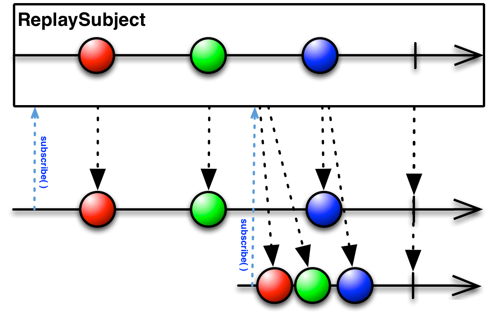
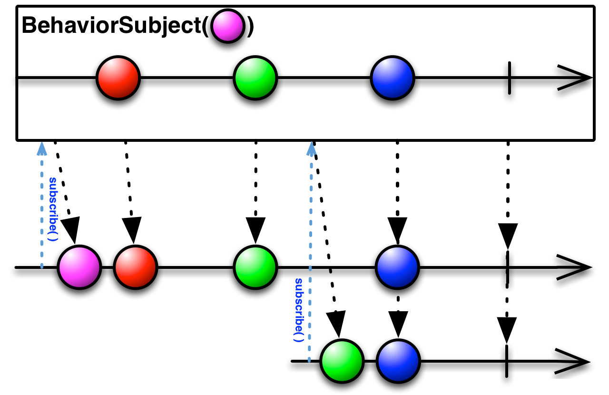
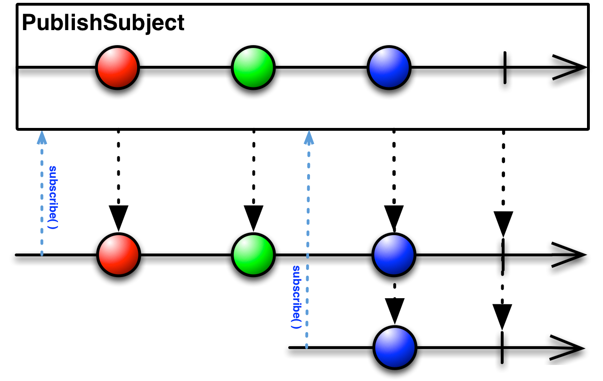
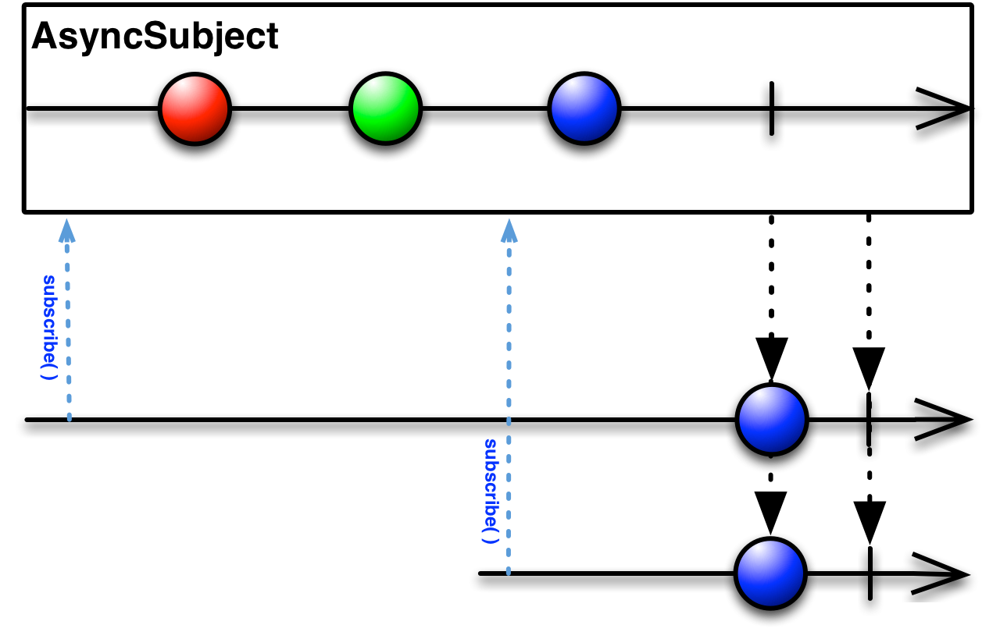

# Rxjava梳理
来源：https://mcxiaoke.gitbooks.io/rxdocs/content/Intro.html

**定义:Rx是一个在JVM上实现响应式编程的库,让开发者利用可观察序列和LINQ风格查询操作符来编写异步和基于事件的程序。**

**核心思想：关注起点（Observable）和终点（Observer），数据加载完成才响应，中间的流程可以添加或删除功能**

特点：**异步编程**（处理异步任务，长时间任务，线程切换，由回调决定控制流，实现高并发）、**事件驱动编程**（处理用户交互、系统消息这种大量的事件驱动的编程任务，由事件源和事件处理程序决定，实现数据流处理）、**函数式编程**（lambda表达式，链式编程，卡片式编程，简洁代码）

重要组成：Observables表示异步数据流，用LINQ操作符查询异步数据流， 用Schedulers参数化异步数据流的并发处理

## Observable：
**概述：观察者对Observable发射的数据或数据序列作出响应，极大地简化并发操作，因为它创建了一个处于待命状态的观察者哨兵，在未来某个时刻响应Observable的通知，不需要阻塞等待Observable发射数据。（并发执行、响应式编程）**

### 与传统观察者模式的区别：
*   传统：一个被观察者对应多个观察者，被观察者维护观察者列表，状态改变时被观察者手动通知观察者。
*   Rxjava：一个被观察者对应一个观察者，被观察者订阅观察者的同时，事件下发，观察者向被观察者（事件源）拉取信息。

### 热启动和冷启动：
*   热启动：Obseravable在任何时候都会发送消息，即使没有任何观察者监听它，因此所有后续订阅它的观察者可能从序列中间的某个位置开始接受数据，可能会错过数据。
*   冷启动：Obseravable只有在至少有一个监听者时才会发送消息，因此这个观察者可以确保会收到整个数据序列。
*   热启动平时用不到，所以我们工作中用到的都是冷启动。

### Observer能接收的三种事件:
* 通过 onNext() 函数推送的数据。
* 通过 onError() 函数推送的错误（异常或 Throwable）。
* 通过 onCompleted() 函数推送的流完成信息。

其中，onNext() 可能永远也不会被调用，也可能会被调用一次、多次或无数次。onError() 和 onCompleted() 是终端事件，这意味着两者只能有一个被调用，并且只能被调用一次。终端事件被调用之后，Observable 流就完成了，以后就不能再向它发送事件了。如果流是无限的，并且没有发生故障，那么终端事件可能永远不会发生。

## Subject:
定义：Subject可以看成是一个桥梁或者代理，在某些ReactiveX实现中（如RxJava），它同时充当了Observer和Observable的角色。因为它是一个Observer，它可以订阅一个或多个Observable；又因为它是一个Observable，它可以转发它收到(Observe)的数据，也可以发射新的数据。

* ReplaySubject （释放接收到的所有数据）

---
* BehaviorSubject （释放订阅前最后一个数据和订阅后接收到的所有数据）

---
* PublishSubject （释放订阅后接收到的数据）

---
* AsyncSubject （仅释放接收到的最后一个数据）

## Scheduler
### 作用：
给Observable操作符链添加多线程功能，ObserveOn指示一个Observable在一个特定的调度器上调用观察者的onNext, onError和onCompleted方法，SubscribeOn更进一步，它指示Observable将全部的处理过程（包括发射数据和通知）放在特定的调度器上执行。

subscribe前是上游（subscribeOn），后是下游（observeOn），可以分别进行线程管理，且一旦订阅事件立刻下发。

多次指定上游的线程只有第一次指定的有效，也就是说多次调用subscribeOn()只有第一次的有效，其余的会被忽略。

多次指定下游的线程是可以的，也就是说每调用一次observeOn()，下游的线程就会切换一次。
